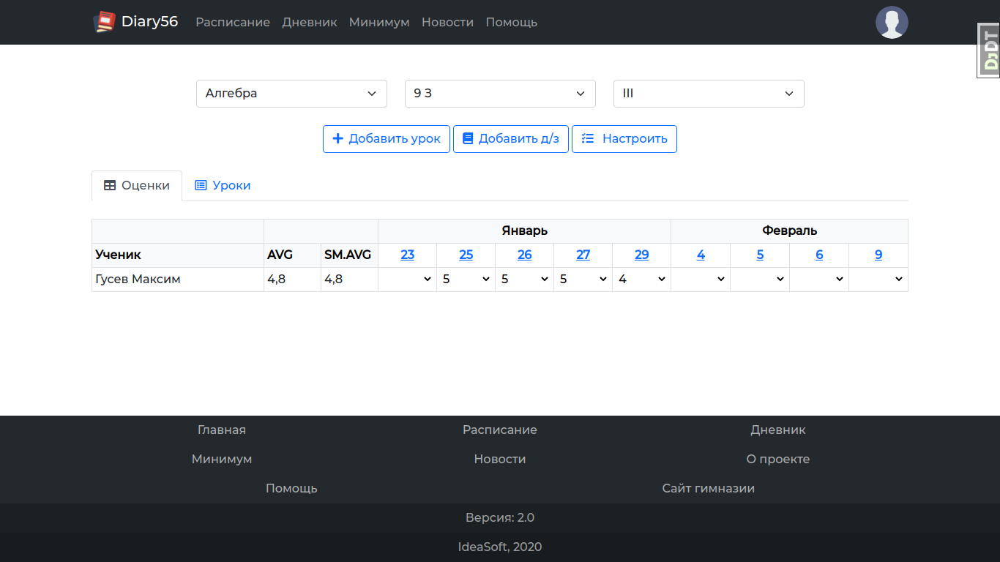
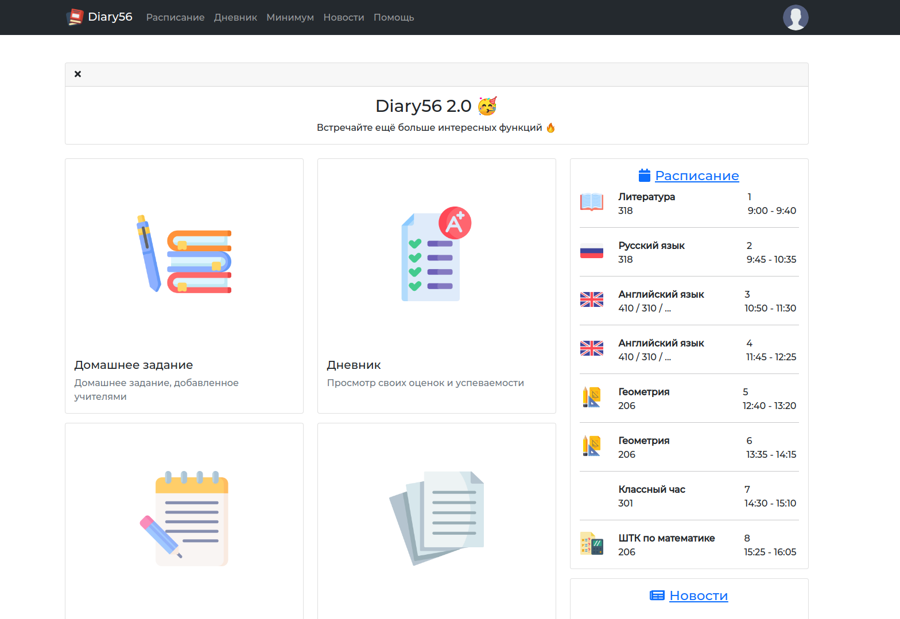
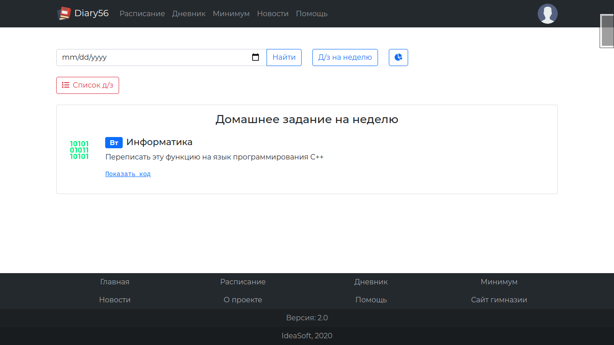

<div align="center">

# School Diary

Open-source digital diary website for schools made with Django.


## This project uses


## Screenshots







## Development setup

<div align="left">

### Preparation

Make sure you've installed Python 3.9+ and added it to `PATH`.
It's recommended to create an empty virtual environment before
installing dependencies.

### Installing dependencies

```
pip install poetry
poetry install
```

### Adding settings file

Create a file called `config.toml` in the root directory
of the project (the same where `manage.py` is located) with
the following content:

```toml
[main]
debug = true
secret_key = "<django secret key>"
allowed_hosts = ['127.0.0.1', 'localhost']

[email]
host = "<smtp server>"
address = "<email address>"
password = "<email passoword>"
port = "<smpt server port>"
use_tls = true
use_ssl = true

[other]
admins = [
    ['<name>', '<email>'],
    ['<name2>', '<email2>']
]

[database]
[database.postgres]
name = "<db name>"
user = "<db user>"
password = "<db password>"
host = "<db host>"
port = "<db port>"

[database.sqlite]
name = "db.sqlite3"

```


### Django stuff

```
cd school_diary
python manage.py makemigrations
python manage.py migrate
python manage.py runserver
```

Then open https://127.0.0.1:8000 and enjoy.

</div>

## Contact us

<a href="mailto:ideasoft.spb@gmail.com"></a>
<a href="https://t.me/AlanTheKnight"></a>

</div>

